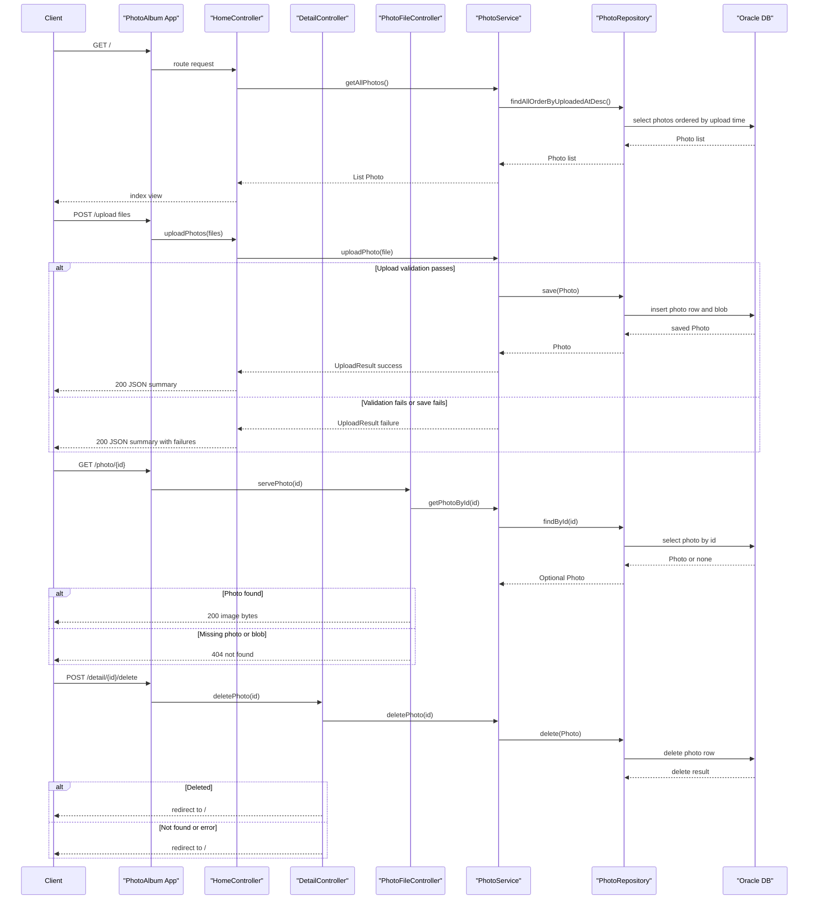

# API & Service Communication Contracts

This application exposes a small Spring MVC surface: a read-only gallery, a photo detail view, a binary photo endpoint, and authenticated upload/delete actions. Communication is direct and mostly synchronous, with the Oracle container acting as the only backend dependency.

## Service Catalog

| Service | Port | Category | Purpose | Key Framework Dependencies |
|---|---:|---|---|---|
| photoalbum-java-app | 8080 | Business | Web UI and photo management app that renders the gallery, handles uploads, and serves photo content | Spring Boot Web, Thymeleaf, Spring Data JPA, Spring Security |
| oracle-db | 1521 | Infrastructure | Oracle database container used for photo metadata and BLOB storage | Oracle Database Free image |

## API Endpoints Inventory

| Service | Method | Path | Request Type | Response Type | Notes |
|---|---|---|---|---|---|
| HomeController | GET | / | No body; model only | HTML view `index` | Returns the gallery page |
| HomeController | POST | /upload | `List<MultipartFile>` form field `files` | `ResponseEntity<Map<String, Object>>` JSON | Returns 400 when no files are provided; upload requires HTTP Basic auth |
| DetailController | GET | /detail/{id} | Path variable `id` | HTML view `detail` | Redirects to `/` when photo is missing or invalid |
| DetailController | POST | /detail/{id}/delete | Path variable `id` | Redirect to `/` | Delete requires HTTP Basic auth |
| PhotoFileController | GET | /photo/{id} | Path variable `id` | `ResponseEntity<Resource>` binary image stream | Returns 404 when photo or photo data is missing |

## Management & Observability Endpoints

| Service | Endpoint | Custom Metrics |
|---|---|---|
| None discovered | None | None |

## DTOs & Contracts

`Photo` is the main domain model and also the view model passed to Thymeleaf pages; it is mutable and entity-backed, not a dedicated API record. `UploadResult` is the upload outcome contract used internally by the controller to build the JSON response for `/upload`; it is mutable and ad hoc rather than a formal REST DTO.

The upload endpoint returns a `Map<String, Object>` payload with `success`, `uploadedPhotos`, and `failedUploads`, so there is no standalone request/response wrapper class for that API. `ResponseEntity<Resource>` is used for photo streaming, and `ByteArrayResource` is the concrete binary wrapper.

No OpenAPI, Swagger, protobuf, or GraphQL contract files were found. Serialization for the JSON upload response comes from Spring MVC Jackson support.

## Communication Patterns

All application traffic is synchronous and in-process until it reaches Oracle through Spring Data JPA. The request path is controller -> service -> repository -> database, with no message broker, no async events, no API gateway, and no service discovery layer.

Resilience is minimal: there are local try/catch blocks that convert failures into redirects, 400s, 404s, or 500s, but no circuit breaker, retry, bulkhead, or timeout policy library is configured. The upload flow enforces state-changing authentication with HTTP Basic and the `ADMIN` role, while read-only endpoints remain public. No TLS configuration was found in the repository, so transport security is not explicitly configured here.

Startup is database-first in Docker Compose: the Oracle service must pass health checks before the Java app starts. Outside Docker, the app expects the database connection details from environment variables.

## Service Technology Matrix

| Service | Web | Data Access | Discovery | Gateway | Actuator | Cache | Metrics |
|---|---|---|---|---|---|---|---|
| photoalbum-java-app | Spring MVC + Thymeleaf | Spring Data JPA | None | None | None discovered | None | None discovered |
| oracle-db | N/A | Oracle database | None | None | N/A | N/A | N/A |

## Service Communication Sequence

