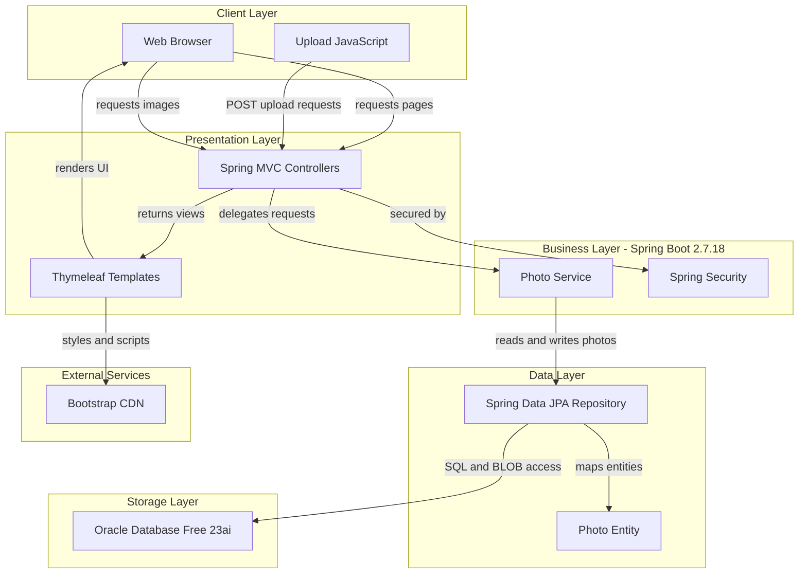
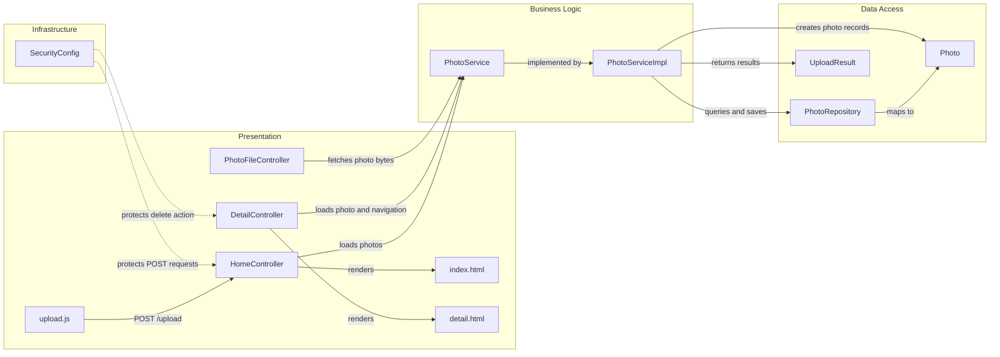

# Architecture Diagram

Photo Album is a Spring Boot 2.7.18 web application that uses Thymeleaf for server-rendered pages and Oracle Database for photo storage. The diagrams below show the main application layers and the key component interactions that connect the gallery, upload, detail, and security flows.

## Application Architecture

### Technology Stack Summary

| Layer | Technology | Version | Purpose |
|---|---|---:|---|
| Presentation | Spring MVC | 5.x via Spring Boot 2.7.18 | Handles gallery, detail, and upload requests |
| Presentation | Thymeleaf | 3.x via Spring Boot 2.7.18 | Server-side HTML rendering |
| Business | Spring Boot | 2.7.18 | Application runtime and dependency management |
| Business | Spring Security | 5.x via Spring Boot 2.7.18 | Protects upload and delete endpoints |
| Data | Spring Data JPA | 2.x via Spring Boot 2.7.18 | Repository abstraction for photo persistence |
| Data | Hibernate JPA | 5.x via Spring Boot 2.7.18 | ORM and entity mapping |
| Storage | Oracle Database Free | 23ai | Stores photo metadata and BLOB image data |
| Runtime | Java | 8 | Application and container runtime |

### Data Storage & External Services

Photos are stored as BLOBs in Oracle Database Free 23ai along with metadata such as filename, MIME type, size, upload time, and dimensions. The web UI also depends on Bootstrap from a public CDN for styling and layout.

### Key Architectural Decisions

- Uses server-rendered Thymeleaf pages instead of a separate frontend SPA.
- Stores image bytes directly in Oracle rather than on the filesystem.
- Protects upload and delete operations with HTTP Basic auth and Spring Security.

## Component Relationships

### Component Inventory

| Component | Layer | Type | Responsibility |
|---|---|---|---|
| HomeController | Presentation | Spring MVC Controller | Serves the gallery page and handles photo uploads |
| DetailController | Presentation | Spring MVC Controller | Shows a single photo and handles deletion |
| PhotoFileController | Presentation | Spring MVC Controller | Streams photo bytes from storage to the browser |
| upload.js | Presentation | Client Script | Handles drag and drop upload interaction |
| index.html | Presentation | Thymeleaf Template | Renders the main gallery view |
| detail.html | Presentation | Thymeleaf Template | Renders the photo detail view |
| PhotoService | Business Logic | Service Interface | Defines photo operations |
| PhotoServiceImpl | Business Logic | Service Implementation | Validates uploads and coordinates persistence |
| PhotoRepository | Data Access | JPA Repository | Reads and writes photo records in Oracle |
| Photo | Data Access | JPA Entity | Stores photo metadata and BLOB content |
| UploadResult | Data Access | DTO | Carries upload success or failure details |
| SecurityConfig | Infrastructure | Security Configuration | Restricts upload and delete endpoints |
