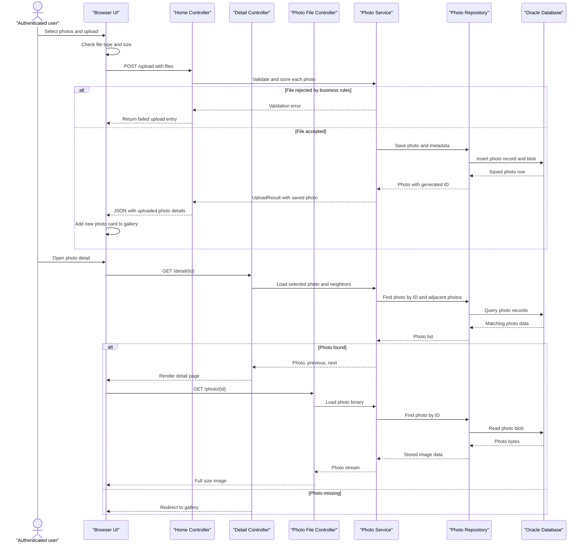

# Core Business Workflows

Photo Album is a browser-based gallery for uploading, browsing, and deleting photos. Users can add images to the shared gallery, open a full-size detail view, navigate between photos, and remove photos from the collection.

## Domain Entities

| Entity | Service / Bounded Context | Description | Key Relationships |
|---|---|---|---|
| Photo | Photo Management | A user-uploaded image stored as the core gallery item with display metadata and binary content. | Rendered in the gallery grid, served as full-size media, linked to previous and next photos in detail view, and removed through the delete flow. |

## Service-to-Domain Mapping

| Service | Domain Context | Owned Entities | External Dependencies |
|---|---|---|---|
| PhotoServiceImpl | Photo Management | Photo | Oracle database for photo persistence; browser uploads and gallery views; Spring Security for protected write actions. |
| HomeController | Gallery Presentation | Photo read model | PhotoService, browser client, upload form. |
| DetailController | Photo Detail Presentation | Photo read model | PhotoService, browser client, delete form. |
| PhotoFileController | Photo Delivery | Photo binary response | PhotoService, browser image requests. |

## Primary Workflows

### Workflow 1: Uploading photos into the gallery

An authenticated user drops or selects one or more image files on the gallery page. The browser performs basic type and size checks first, then submits `POST /upload` with multipart form data.

`HomeController` sends each file to `PhotoService.uploadPhoto()`, which enforces the business rules: supported MIME type only, file size within the configured limit, non-empty payload, and safe image dimension extraction. The service generates a UUID-based stored name, reads the binary payload, captures width and height when possible, creates a `Photo`, and saves it to the database.

For each file, the controller returns either a successful upload entry with the saved photo metadata or a failure entry with the validation or persistence error. The browser updates the gallery immediately with any saved photos.

### Workflow 2: Browsing the gallery and opening photo details

A visitor opens `GET /` to view the newest photos first. `HomeController` loads the gallery list from `PhotoService`, and the page renders each photo as a card with a thumbnail, upload time, file size, and optional dimensions.

When the user opens a photo, `DetailController` loads the selected `Photo` and also asks the service for the adjacent older and newer photos. The detail page then requests the photo binary from `PhotoFileController`, which streams the stored image back to the browser, while the page uses the metadata to show previous or next navigation links.

If the requested photo no longer exists, the app redirects back to the gallery instead of showing a broken detail page.

### Workflow 3: Deleting a photo from the collection

From the detail page, an authenticated user confirms deletion and submits `POST /detail/{id}/delete`. `DetailController` delegates to `PhotoService.deletePhoto()`, which checks whether the photo exists before removing it from the database.

Successful deletion returns the user to the gallery with a success message. If the photo is missing, the user gets a not-found message; if persistence fails, the app reports a generic failure.

## Cross-Service Data Flows

This application does not compose data across multiple backend services. All workflow data stays inside one Spring Boot application and one Oracle database, so gallery, detail, upload, and delete flows are all different views over the same `Photo` record set.

The main composition happens inside the app: upload requests become `Photo` records, gallery cards are rendered from the ordered photo list, detail pages combine the selected photo with neighboring photos, and image responses stream the stored binary payload back to the browser.

## Business Workflow Sequence

## Business Rules & Decision Logic

- Uploads accept only JPEG, PNG, GIF, and WebP images.
- Each uploaded file must be non-empty and within the configured 10 MB limit.
- The service limits decoded image dimensions to prevent oversized image payloads.
- Photo IDs are generated as UUIDs to keep gallery entries globally unique.
- Upload and delete actions require authentication; gallery browsing and photo viewing remain public.
- Gallery ordering is newest first, based on upload time.
- Detail navigation uses upload timestamps to find the previous and next photo.
- If a requested photo is missing, the app returns the user to the gallery rather than failing the page.
- If deletion targets a missing photo, the app reports not found instead of treating it as success.
- Photo metadata and binary content are stored together so the image and its business details stay consistent.
