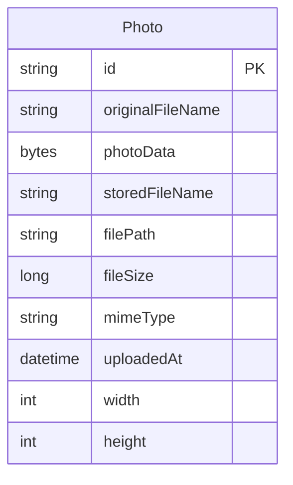

# Data Architecture & Persistence Layer

This application uses a single Oracle-backed JPA entity for photo storage, with H2 reserved for tests. Hibernate manages schema creation directly, and there is no dedicated application cache or migration tool configured.

## Database Configuration

| Service/Module | DB Type | Profile | Driver | Connection | Migration Tool | Schema Management | Seed Data |
| --- | --- | --- | --- | --- | --- | --- | --- |
| PhotoAlbum application | Oracle Database | default and local | oracle.jdbc.OracleDriver | JDBC URL defaults to `jdbc:oracle:thin:@oracle-db:1521/FREEPDB1`, with environment variable overrides for local Oracle access | None found | Hibernate creates schema automatically in the main profile | None found |
| PhotoAlbum application | Oracle Database | docker | oracle.jdbc.OracleDriver | Docker Compose injects `jdbc:oracle:thin:@oracle-db:1521/FREEPDB1` | None found | Hibernate creates schema automatically in the docker profile | None found |
| PhotoAlbum tests | H2 in-memory | test | org.h2.Driver | `jdbc:h2:mem:testdb` | None found | Hibernate creates and drops schema for tests | None found |

No Flyway, Liquibase, or SQL seed scripts were found. Spring Boot uses the default HikariCP pool, but no pool sizing overrides are configured.

## Data Ownership per Service

| Service | Tables Owned | ORM Framework | Caching | Notes |
| --- | --- | --- | --- | --- |
| PhotoAlbum application | `PHOTOS` | Spring Data JPA with Hibernate | None | Stores photo metadata and BLOB content in Oracle; all persistence flows through `PhotoRepository` |

## Entity Model

Source file: `src\main\java\com\photoalbum\model\Photo.java`

## Key Repository Methods

| Service | Repository | Notable Methods | Purpose |
| --- | --- | --- | --- |
| PhotoAlbum application | `PhotoRepository` | `findAllOrderByUploadedAtDesc()` | Returns photos newest first for gallery display |
| PhotoAlbum application | `PhotoRepository` | `findPhotosUploadedBefore(LocalDateTime uploadedAt)` | Returns older photos for previous navigation |
| PhotoAlbum application | `PhotoRepository` | `findPhotosUploadedAfter(LocalDateTime uploadedAt)` | Returns newer photos for next navigation |
| PhotoAlbum application | `PhotoRepository` | `findPhotosByUploadMonth(String year, String month)` | Oracle-specific filter by upload month |
| PhotoAlbum application | `PhotoRepository` | `findPhotosWithPagination(int startRow, int endRow)` | Oracle row-number pagination |
| PhotoAlbum application | `PhotoRepository` | `findPhotosWithStatistics()` | Returns ranking and running totals as raw query results |

Standard CRUD methods come from `JpaRepository<Photo, String>` and are inherited.

## Caching Strategy

No server-side cache provider is configured. The data layer uses direct database reads through JPA, while photo responses are sent with no-cache headers and the UI adds timestamp-based cache busting. That keeps gallery changes visible immediately and avoids stale BLOB content.

## Data Ownership Boundaries

The application uses a single database and a single persistence boundary. Controllers call `PhotoService`, the service coordinates transactional work, and repository access is limited to `PhotoRepository`; there is no direct cross-service database access, CQRS split, or shared datastore between independently deployed modules.

`PhotoFileController` serves BLOB content directly from Oracle and explicitly disables browser caching. `HomeController` also adds a timestamp for UI cache busting, but there is no application cache layer such as Redis, Caffeine, EhCache, or Hibernate second-level cache.

### Data Classification & Sensitivity

| Entity | Sensitive Fields | Classification | Controls in Place |
| --- | --- | --- | --- |
| Photo | `photoData`, `originalFileName`, `storedFileName`, `filePath`, `uploadedAt` | PII | No encryption-at-rest, masking, or field-level access controls were found in the application layer; photos are stored directly as Oracle BLOBs |

Photo content can contain personal information depending on what users upload, so it should be treated as sensitive user data.
