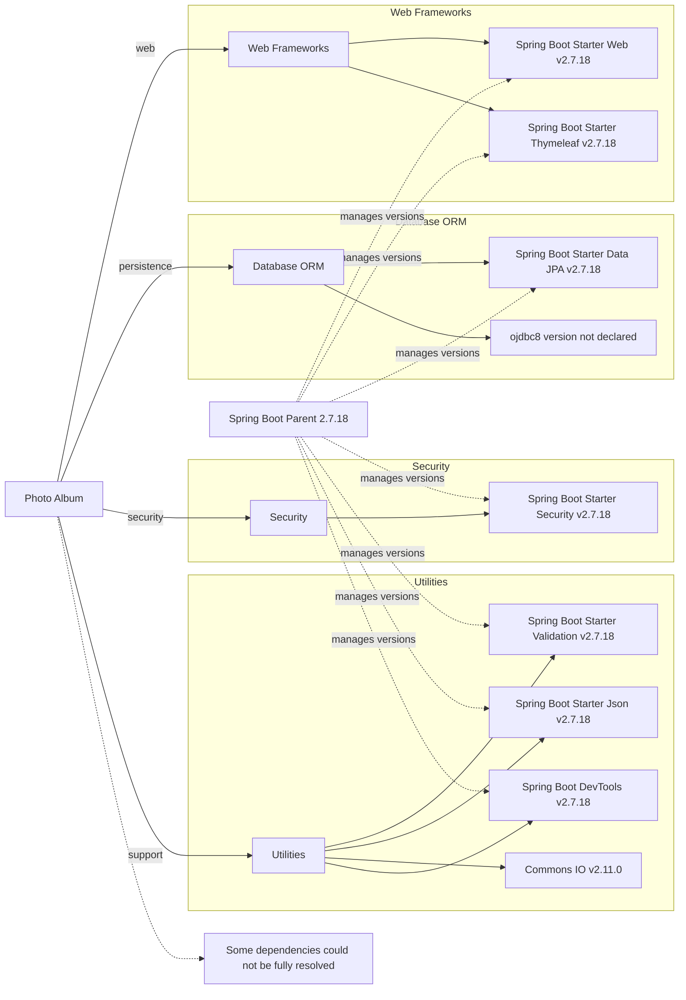

# Dependency Map

Photo Album declares 11 direct dependencies in its Maven build, with 9 in the main/runtime set and 2 test-scoped dependencies.

## Dependencies

### Dependency Summary

| Category | Count | Key Libraries | Notes |
|---|---:|---|---|
| Web Frameworks | 2 | Spring Boot Starter Web, Spring Boot Starter Thymeleaf | MVC web app with server-side rendering |
| Database ORM | 2 | Spring Boot Starter Data JPA, ojdbc8 | JPA persistence on Oracle JDBC |
| Security | 1 | Spring Boot Starter Security | Stateful endpoint protection from Spring Security |
| Utilities | 4 | Spring Boot Starter Validation, Spring Boot Starter Json, Commons IO, Spring Boot DevTools | General support libraries and dev-time tooling |

### Version & Compatibility Risks

This project is anchored on Spring Boot 2.7.18 and Java 8, both of which are legacy baselines for new modernization work. The Boot 2.7 line stays on pre-Jakarta APIs, so moving to Spring Boot 3 will require a Java 17+ upgrade and namespace changes across the stack. `ojdbc8` is runtime-only and its version is not declared in the POM, which leaves the exact Oracle driver level unresolved from build metadata alone.

### Notable Observations

- Spring Boot manages most framework versions centrally through the parent POM; only Commons IO is pinned explicitly in the build.
- The app mixes server-side templating with Spring MVC and JPA persistence, so modernization has to preserve both web and data-access behavior.
- `spring-boot-devtools` is marked optional, which is appropriate for local development but should stay out of production packaging.
- No messaging, caching, or observability dependencies are declared in the build.

## Test Dependencies

| Framework | Version | Notes |
|---|---|---|
| Spring Boot Starter Test | 2.7.18 | Aggregates the standard Spring test stack, including JUnit 5 and Mockito |
| H2 Database | managed by Spring Boot 2.7.18 | In-memory database for repository and persistence tests |

Total test-scope dependencies: 2

The test setup is lightweight and focused on unit and JPA-style tests. No Testcontainers, contract-testing, or dedicated integration-test framework is declared.
